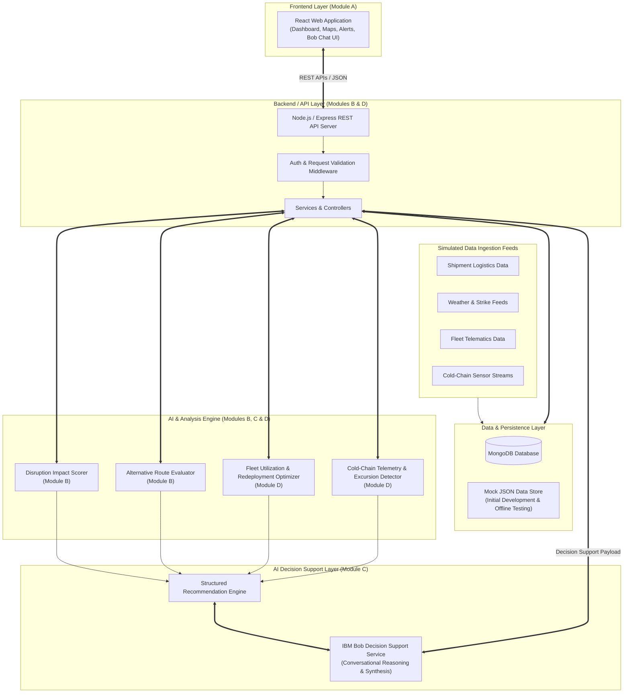

# Complete System Architecture — SupplyGuard AI

This document defines the final system architecture, layer boundaries, and component responsibility matrix for **SupplyGuard AI** for the IBM Bob AI Hackathon 2026.

---

## 1. High-Level Architecture Diagram

---

## 2. System Layers & Integration Boundaries

### A. Frontend Layer (`src/frontend/`) — Module A
- **Responsibilities:** Renders the operational UI dashboard, risk heatmaps, cold-chain alert feeds, fleet asset status views, and the IBM Bob conversational sidecar interface.
- **Boundaries:** Communicates exclusively with the Backend API layer via documented HTTP REST endpoints using standard JSON envelopes. Contains zero direct database drivers or raw AI models.

### B. Backend / API Layer (`src/backend/`) — Modules B & D
- **Responsibilities:** Exposes RESTful API endpoints, handles request validation, manages database queries, orchestrates rule evaluations, and marshals payload context for AI services.
- **Boundaries:** Acts as the central mediator between the database, analytical calculation modules, and the AI decision-support engine.

### C. Database Layer (MongoDB)
- **Responsibilities:** Provides persistent storage for Users, Shipments, Disruptions, Routes, Fleet Assets, Cold-Chain Sensors, Telemetry Readings, and Generated AI Recommendations.
- **Boundaries:** Accessible only by the Backend API services via Mongoose/MongoDB drivers.

### D. Analytical & AI Processing Layer (`src/backend/` / `src/ai/`) — Modules B, C & D
- **Responsibilities:**
  - **Deterministic Engines (Modules B & D):** Calculates geofencing intersections, route cost/time differences, fleet capacity matching, and thermal excursion thresholds.
  - **AI & IBM Bob (Module C):** Transforms structured analysis metrics into natural-language operational summaries, prioritized intervention strategies, and interactive decision support.

### E. IBM Bob Integration Boundary
- **Role:** IBM Bob provides a natural-language conversational decision support engine. It consumes structured operational context (compromised shipments, route alternatives, idle assets, thermal alerts) supplied by the Backend and produces actionable guidance for operators.
- **Technical Note:** IBM Bob's exact HTTP/SDK integration client will be instantiated via backend service wrappers (`src/backend/services/bobService.js`). The contract between the Backend and IBM Bob is strictly standardized via JSON payload schemas.

---

## 3. Component Responsibility Matrix

| Component | Responsibility | Tech Stack | Module Owner | Status |
| :--- | :--- | :--- | :--- | :--- |
| **Operator Dashboard UI** | Visualizes active shipments, disruptions, cold-chain alerts, and fleet status | React, Vite, CSS | **Module A** | Planned Blueprint |
| **IBM Bob Chat UI** | Interactive conversational sidebar component | React | **Module A** | Planned Blueprint |
| **Shipment & Disruption API** | Serves shipment records and disruption impact evaluations | Node.js, Express | **Module B** | Planned Blueprint |
| **Routing Recommendation Engine** | Calculates alternative corridors and risk scores | Node.js / Python | **Module B** | Planned Blueprint |
| **Fleet & Cold-Chain API** | Manages fleet asset status and cold-chain sensor streams | Node.js, Express | **Module D** | Planned Blueprint |
| **Thermal Excursion Evaluator** | Evaluates thermal readings against safe operating bands | Node.js / Python | **Module D** | Planned Blueprint |
| **AI Recommendation Engine** | Generates prioritized recommendation records | Python / Node.js | **Module C** | Planned Blueprint |
| **IBM Bob Service Client** | Wraps IBM Bob API calls and manages prompt context | Node.js | **Module C** | Planned Blueprint |
| **Database Persistence** | Document storage and indexing for all system entities | MongoDB | Shared | Planned Blueprint |
