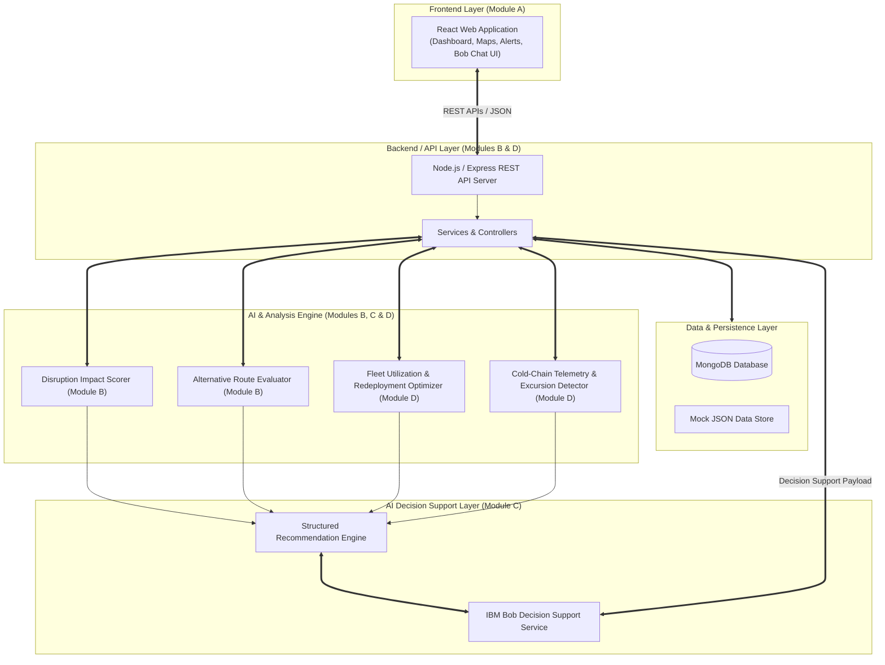

# Architecture

## System Architecture

SupplyGuard AI employs a 4-layer modular architecture designed for high throughput, contract-first parallel development, and reliable AI decision support.

## Components

| Component | Technology | Responsibility | Module Owner |
|---|---|---|---|
| **Frontend UI** | React 18, Vite, CSS | Operational dashboard, interactive maps, excursion alerts, IBM Bob UI | **Module A (Member 1)** |
| **Shipment & Disruption API** | Node.js, Express | Shipment tracking, disruption geofencing, route risk scoring | **Module B (Member 2)** |
| **AI Recommendation & IBM Bob** | Python, Node.js, IBM Bob | Recommendation synthesis, risk prioritization, conversational assistant | **Module C (Member 3)** |
| **Fleet & Cold-Chain API** | Node.js, Express | Fleet asset utilization, idle asset matching, IoT sensor log processing | **Module D (Member 4)** |
| **Database Layer** | MongoDB | Document persistence for shipments, disruptions, routes, fleet, readings | **Shared** |

## Data Flow

1. External logistics and sensor streams update shipment locations, disruption events, and cold-chain thermal telemetry in MongoDB.
2. Analytical engines evaluate geofence intersections, route cost/time deltas, idle fleet proximity, and thermal excursion thresholds (`temp < min` or `temp > max`).
3. The AI Engine synthesizes structured metrics into prioritized recommendations (`rec_8001`).
4. IBM Bob consumes structured operational context to generate natural-language rationale and answer conversational dispatcher queries.
5. The React Dashboard polls REST APIs using standard envelopes (`{ success: true, data: {} }`) to display alerts, maps, and recommendations.

## Security Considerations

- API keys and database URIs are loaded exclusively from `.env` environment variables and never committed to source control.
- Frontend communicates solely via authenticated REST endpoints and has zero direct access to MongoDB credentials.
- All API inputs are validated using schema middleware before processing.

## Scalability Notes

- Backend services are stateless and can be horizontally scaled behind a load balancer.
- Telemetry ingestion from IoT cold-chain sensors uses non-blocking asynchronous I/O to handle high event volumes smoothly.
